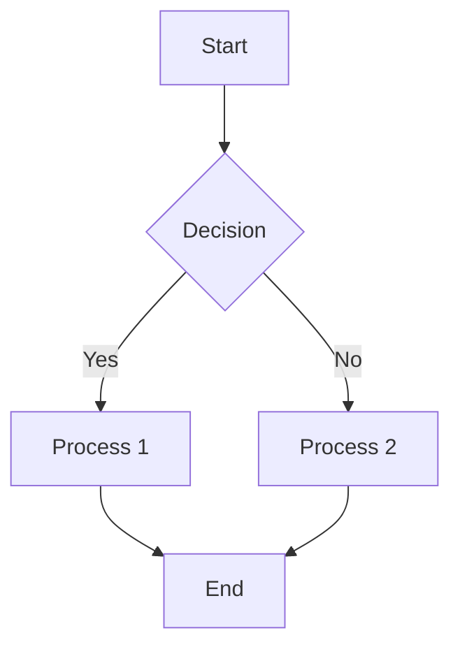

# Diagrams

Architecture diagrams, flowcharts, and visual representations of concepts.

## Organization

Diagrams are organized by section:

```
diagrams/
├── comptia-a-plus/
├── linux/
├── python/
├── networking/
└── labs/
```

## Naming Convention

`[section]-[type]-[description].png`

**Types**:
- `diagram`: Architecture or structural diagrams
- `flowchart`: Process flows and decision trees
- `model`: Conceptual models and frameworks
- `architecture`: System architecture diagrams
- `topology`: Network topology diagrams

**Examples**:
- `networking-model-osi-layers.png`
- `comptia-a-plus-diagram-motherboard-layout.png`
- `linux-flowchart-permission-checking.png`
- `labs-architecture-vm-setup.png`

## File Formats

### PNG (Preferred)
- Best for web
- Maintains quality
- Compresses well
- Wide browser support

### SVG (Scalable Vector)
- Best for diagrams
- Scales without quality loss
- Smaller file sizes
- Interactive potential

### Source Files
- Keep editable versions locally
- Document tools used
- Export to PNG/SVG for repository

## Diagram Types

### Network Diagrams
- OSI Model layers
- TCP/IP model
- Network topologies
- Subnet layouts
- Traffic flows

### System Diagrams
- Motherboard layout
- File system hierarchy
- Hardware components
- Boot process flow
- System architecture

### Process Flowcharts
- Troubleshooting steps
- Permission checking
- Authentication flow
- Installation process
- Decision trees

### Educational Models
- Conceptual frameworks
- Learning progressions
- Skill levels
- Topic relationships
- Study paths

## Tools for Creating Diagrams

### Online (No Installation)
- **Draw.io**: Free, versatile, cloud-based
- **Lucidchart**: Professional, collaboration features
- **Miro**: Whiteboarding and diagramming
- **Canva**: Design tool with templates

### Desktop Applications
- **OmniGraffle**: Professional (Mac focused)
- **Visio**: Microsoft standard
- **Graphviz**: Code-based diagrams
- **Inkscape**: Open-source vector editor

### Open Source
- **Dia**: Diagram tool
- **yEd**: Graph editor
- **PlantUML**: Diagram from code
- **Mermaid**: Markdown diagrams

## Creating Diagrams with Mermaid

For simple diagrams, use Mermaid syntax in markdown:



Export from Mermaid Live Editor to PNG.

## Best Practices

### Design
- ✅ Use consistent colors
- ✅ Keep layout logical and clear
- ✅ Use standard symbols and notation
- ✅ Include legends if needed
- ✅ Label all components clearly

### Accessibility
- ✅ Use accessible color contrasts
- ✅ Don't rely only on color
- ✅ Include descriptive alt text
- ✅ Add captions when needed

### Files
- ✅ Export at appropriate resolution
- ✅ Optimize for web
- ✅ Name descriptively
- ✅ Keep source files

## Optimization

Before committing diagrams:

```bash
# Compress PNG
pngquant --quality=70-100 input.png --output output.png

# Or use ImageMagick
convert input.png -quality 85 -strip output.png

# For SVG, validate and minify
svgo input.svg --output output.svg
```

## Updating Diagrams

When updating existing diagrams:

1. Keep source files current
2. Export new version
3. Replace in repository
4. Update markdown if description changed
5. Commit with clear message

```bash
git commit -m "[Assets] Update networking OSI model diagram with clarifications"
```

## Accessibility Considerations

### Alt Text Examples

```markdown

```

### Figure Captions

```markdown


*Figure 1: Network architecture showing client-server communication with firewall protection*
```

## Diagram Gallery

Consider maintaining a visual index:

**Available Diagrams**:
- Networking: OSI Model, TCP/IP, Subnetting
- CompTIA A+: Motherboard, Boot Process, Hardware Hierarchy
- Linux: File System, Permission Model
- Labs: VM Architecture, Network Topology

---

*Last Updated: 2026-05-25*
